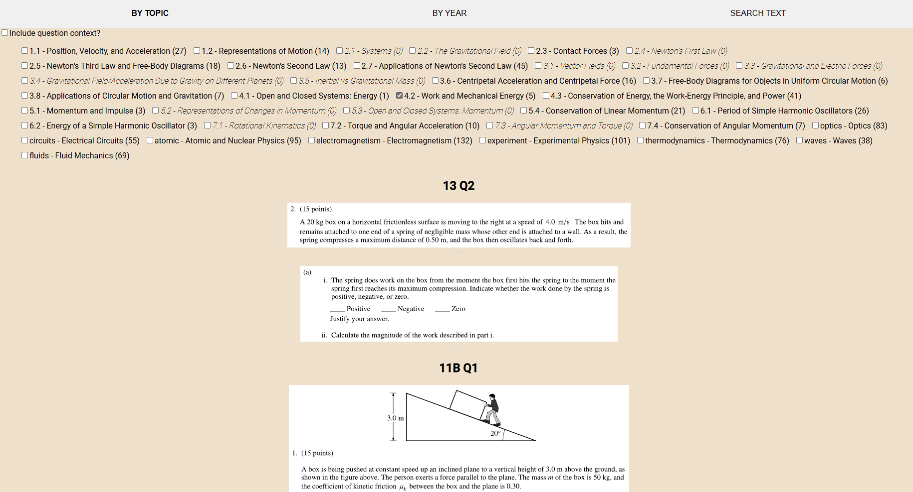
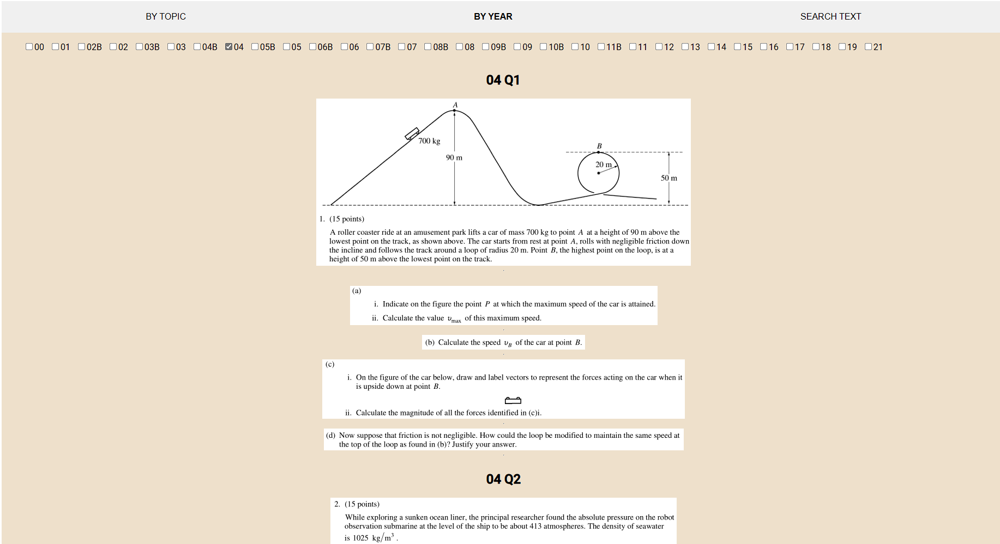
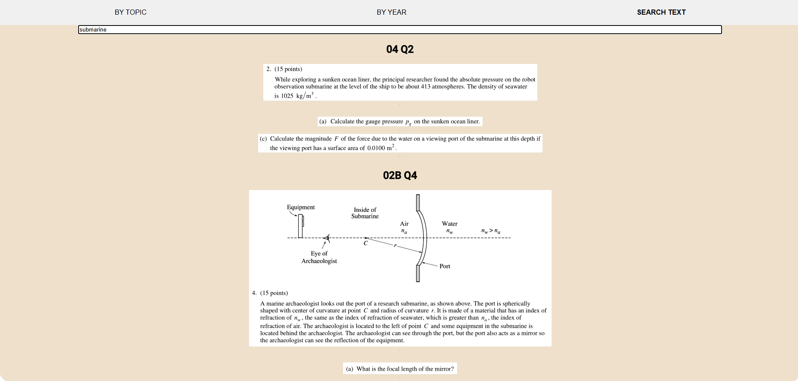

# AP Physics Question Bank

Link to live website: [AP Physics Question Bank](https://ap-physics-question-bank.herokuapp.com/)

## Introduction

This project provides a searchable database of AP Physics questions from past exams. It's designed to help students and educators easily find relevant practice questions by topic, year, or specific content.

## Features

- Search questions by topic
- Search questions by year
- Search by text within problem statements

## Usage

### Search by topic:

### Search by year:

### Search by text within problem statement:

## Technologies Used

- Tesseract OCR for text scraping
- React for frontend
- Heroku for deployment

## Disclaimer

This AP Physics Question Bank is an unofficial resource created for educational purposes only. All questions and materials within this repository are the intellectual property of the College Board. This project is not affiliated with, endorsed by, or sponsored by the College Board. The use of these materials is intended for personal study and practice only. Users are advised to respect copyright laws and to use this resource in accordance with fair use principles for educational purposes.